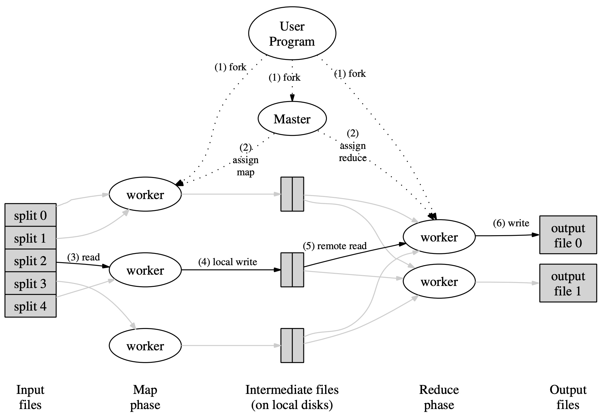
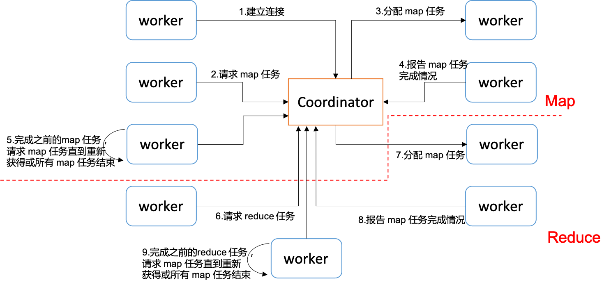

# MIT6.824
 Lab for MIT6.824

## Lab 1: MapReduce
&emsp;&emsp;MapReduce 论文中的系统架构如下：

&emsp;&emsp;整个系统中 `worker` 和 `coordinator` 的交互状态包含下图所示的一系列情况：

详细的实现过程参见[MIT6.824 Lab1](https://jiahaohong1997.github.io/2022/04/06/MIT6.824%20Lab1/)